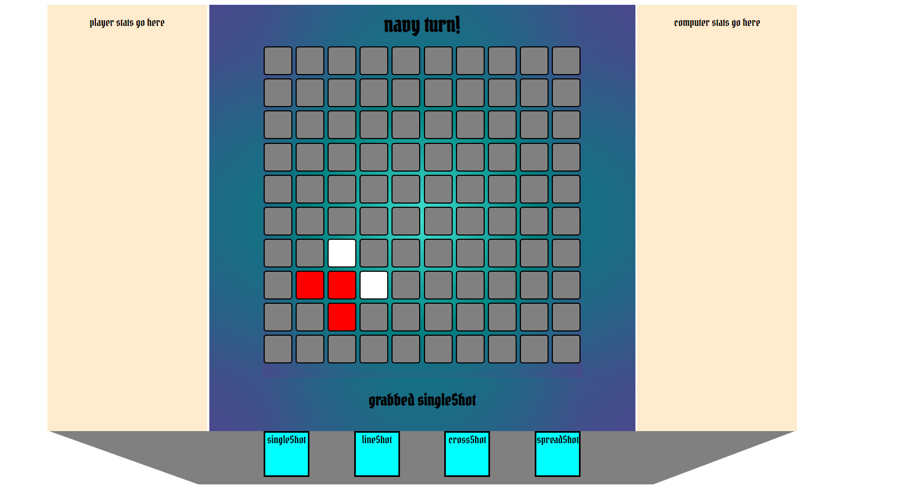

# Battleship

# Technology Used

The following technology was used in order to create this demo

    JavaScript
    HTML
    CSS

Getting Started

To test it out for yourself click this link:
[title](https://sweengman.github.io/Battleship/)

Instructions:

    - click the pirate or navy button at the bottom to select your theme!
    - select simple rectangle ship renders from the side and place them on the grid with your mouse. 
    - click the currently selected side-ship to rotate your ship render. 

## do to minor bugs, some of the unique 'shot-types' aren't working
Next Steps
- add delay between rounds to confirm your selection
- fix shot-types
- update models
- add sound
- revamp css

