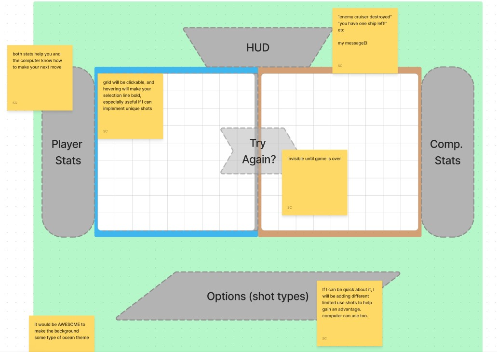

# Functionality
## minimum viable product

As a user I want to...
- play against AI that plays smart, or else the game will be too easy, thus boring

- be able to select the tile I want to shoot with a simple mouseclick, as a simple UI will help me enjoy the game (by keeping focus where it should be)

- be able to shoot any square once in a 10x10 tile because {(that's how it's played) = obvReason}

- be able to choose where my ships go on the board for obvReason

- be able to see what locations were shot previously and if they hit or miss to help me make informed decisions

- be able to win or lose by destroying all enemy ships or vica versa for obvReason

### GA project requirements.
    - Render in browser.
    - Include win/loss logic and render win/loss messages in HTML.
    - Include separate HTML, CSS, and JavaScript files.
    - Use vanilaa JavaScript
    - Have properly indented code.
    - Contain no un-used/commented out code.
    - Functions and variables named sensibly.
    - Coded in a consistant manner.
    - Be deployed online using GitHub pages.

### battleship rules
each player 
1. Selects where their ships go.
2. Take turns selecting one tile to shoot on a 10x10 grid until one of the players ships are completely destroyed.
(their choice will be marked with a hit or miss in order to help them infer where they should shoot next).

### nice to have
powerups or special shots
difficulty mode
fancy gameboard
rendered images

# Design
- I want it to be navy vs pirates
- I want it to be navy blues and grays vs browns and reds
- 

# UI Wireframe

# Psuedocode
## constants

## classes
- boat class
- board class
- player class (includes computer) {
    - boat 1 - 5
    - playerID (links up to turn var)
    - cannonshot types
    - board object (from class? does this work?)

}

## variables
- turn
- winner
- board(object from class)

## objects
- player (object from class)
- computer (object from class) {
    AI functionality
}
## cached DOM
- message
- select faction buttons
- player and comp stat sections
- grid divs
- cannonshot divs
- images/gifs (for hit vs miss and possibly boat sink)
- play again
- 10 ship els, each with own ID
- section id #ship-select (for selecting ships and where to put them)

## on load

on load
- init
    - render
        - choose faction
        - sound of waves?
    - variables

## eventlisteners
- all are on 'click'
    - choose faction (changes) 
        - ship style 
        - music, 
        - starts rest (allows render of) computer grid 
        - info sections 
        - side sections
        - bind's ship faction divs to player and computer ship object vars. 
    - place ships
        - click ship from 'ship-select'
    - grid divs
        - selects target tile
        - blasts (image or animation if this is my wildest dream)
        - reveals if hit or miss with image
        - reveals boat if destroyed
    - choose cannontype
        - changes which function is used during the grid divs   listener (in my dreams again, changes how the hover CSS works)

    - play again
    
## functions
### div e.targeters
- shootSpot
- shootCross
- shootLine
- shootSpread

### theme changers
- decoratePirate
- decorateNavy

### game evals
- checkWin
- boatHit
- checkSink

### AI functionality
- ifTurn (check turn var, check winner var)
    - check viable options (choose from unhit divs)
    - check smart options (don't shoot own ships && if enemy objectShip hit last turn, choose from adjacent divs)
    - pickSpot (math.random)
    - endTurn
